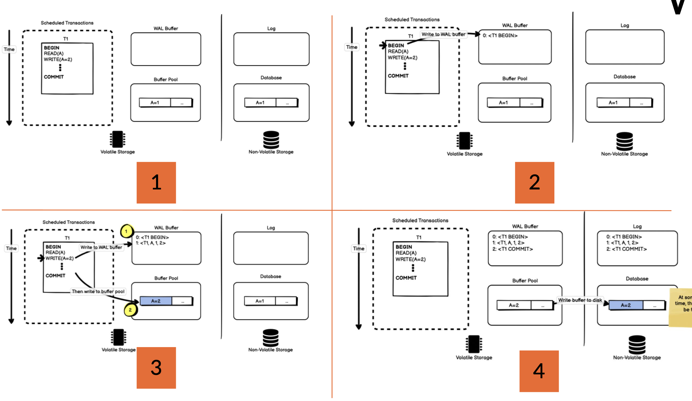
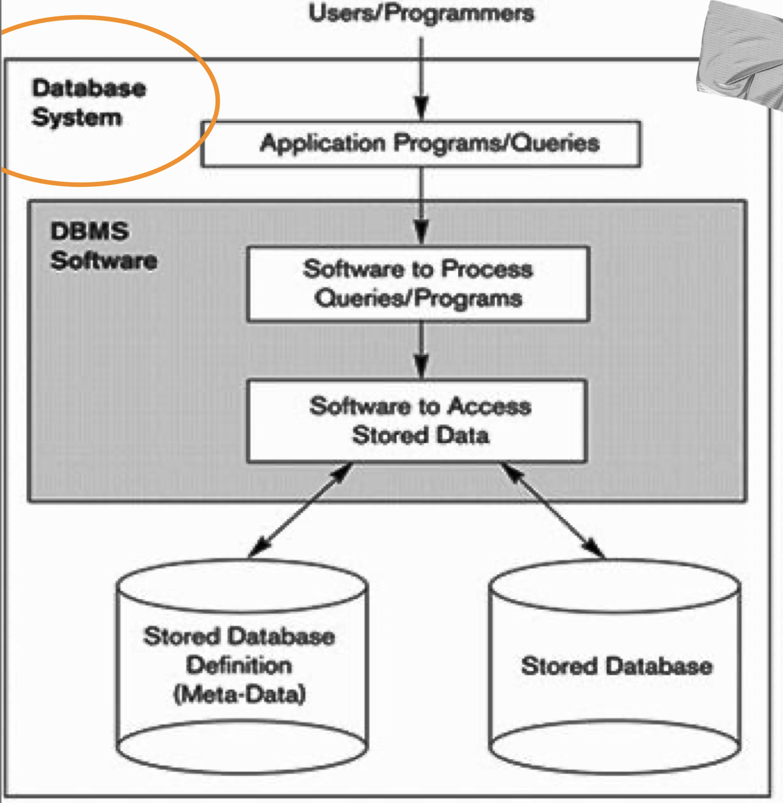
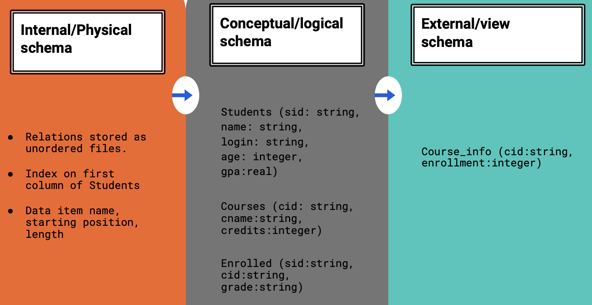
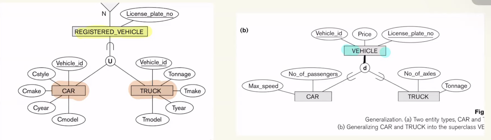
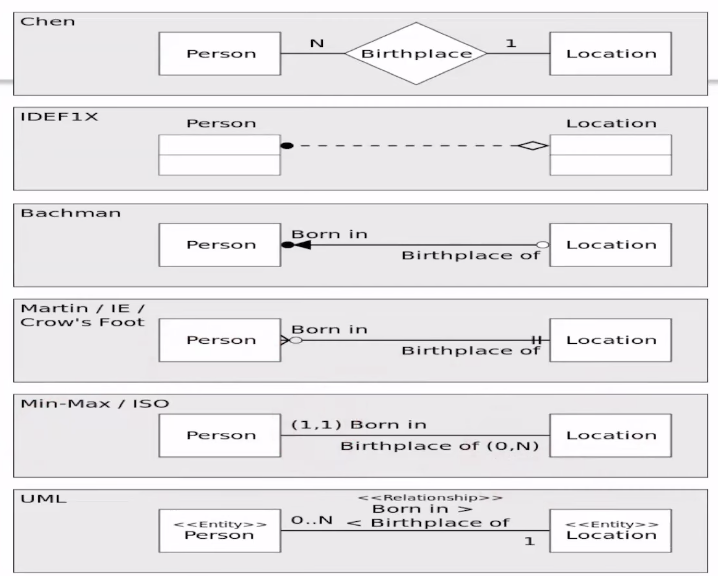
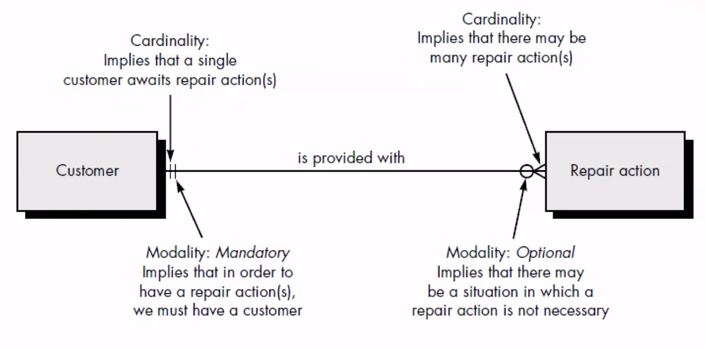
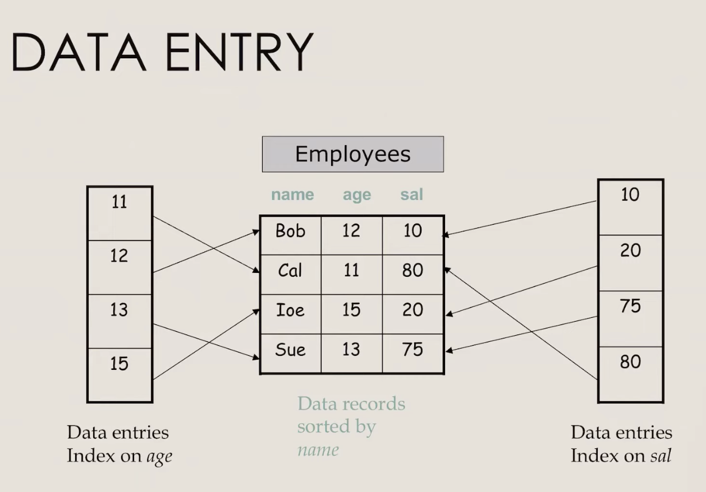
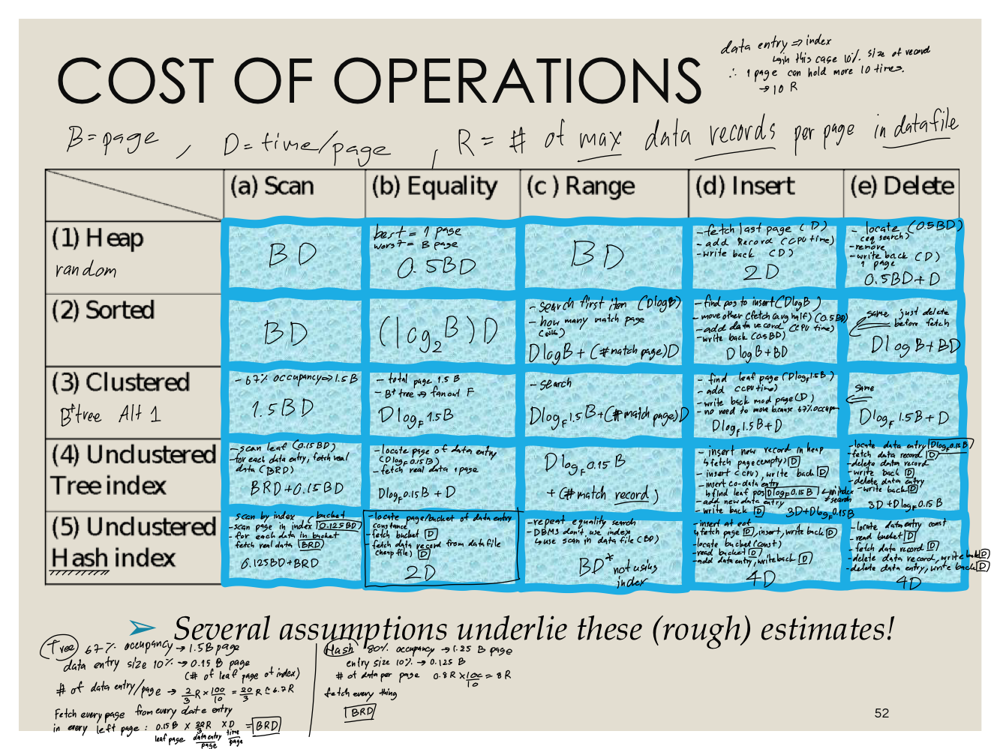

<!-- 
todo: 
add table of content, resize image 6, 7
 -->

# Table of content
1. [Unit 1: Overview](#unit-1)
2. [Unit 2: ER Model](#unit-2)
3. [Unit 3: The Relational Model and Relational Database Design](#unit-3)

 

# Unit 1
### Overview
### Ternimalogy :
- **Data** - 50 cats
- **Database** 
    - collection of data which can acessed from computer system
    - The data in the same database should relate
        have "entities" along with "relationships"
- **Database machines** - or back end processer is the hardware for database
- **DBMS** - Database Managment - software package for database

### DBMS Character
- **less redundancy** - the same piece of data store many place
- **data consistency** - accurate and up-to-date across difference system
- **data intergrity** - unsure that data remain intact, uncorrupt
- **data security** - implement strict access rule, encrytion
- **multi-user support** - concurrency control
- **backup & recovery** 
- **query language support**
- **_ACID transaction_** (not all DBMS can do all the ACID)
    - **A: Atomicily** - transactions are all or nothing
    - **C: Consistency** - Only valid data will be saved
    - **I: Isolation** - transactions don't affect each others
    - **D: Durabulity** - written data will not be lost
    - How are ACID transactions implemented
        - most via "lock"
        - to guarantee duability use "write-ahead lock"
        - rolled back or continued from the transaction log left off
        - 
        
### CAP theorem or Brewer's theorem
- impossible for a dist data store to simultaneously provide more than two of
1. **Consistency**: when system return info, it is always up-to-date
2. **Availability**: systems always return info, even if state
3. **Partition tolerance**: system continues oparating during a patition

### A Simplified Database System Environment

### Level of Abstraction Three Schema Architecture

1. **Internal Level** - low-level data structure
2. **Conceptual Level** - what data to store and what relationships
3. **External Level** - difference view of users

### SQL Language
- **DDL** (Data Definition Language)
    - create, drop, comment
- **DML** (Data Manipulation Language)
    - select, update, insert, call
- **DCL** (Data Control Language)
    - grant, revoke
- **TCL** (Transaction Control Language)
    - commit, rollback

> NoSQL = Not Only SQL or Non-SQL 
> NoSQl is non-relational database, compatable with Big data

||RDBMS|NoSQL|
|---|---|---|
|Type|Realtional|Non-Relational|
|Data Format|Table|JSON(Text) etc.|
|Scaling|Vectical (increase Spec Server)|Horizontal(increase Sever)|
|Schema|Fixed|Flex|
|Ex|Oracle, MySQL, Microsoft SQL|MongoDB|

 

# Unit 2
### ER-model
<!-- #### Chapter Outline

1. [Example Database Application (COMPANY)](#example-database-application-company)
2. [ER Model Concept (traditional approach)](#er-model-concept-traditional-approach-high-level-conceptual-data-model)
3. [ER Diagrams - Notation](#er-diagrams---notation)
4. [ER Diagram for COMPANY Schema](#er-diagram-for-company-schema)
5. [Alternative Notation - UML class diagrams, others](#alternative-notation---uml-class-diagrams-others)
  -->

<!-- ## Example Database Application (COMPANY) -->
<!-- go read kub mai su la -->

<!-- ## ER Model Concept (traditional approach): high-level conceptual data model -->
- **Entities** are specific objects in the database
- **Attributes** are properties used to describe any entity
    - Type of Attributes
        1. **Simple** - single atomic ex. SSN, Sex
        2. **Composite** - may be composed of several component ex. Address (Apt#, House#, City)
        
        3. **Single-valued** - ex. age, height
        4. **Multi-valued** - ex. {car}
    - 
        1. **Stored attributes** - birth date
        2. **Derived attributes** - age
        3. **Null values** - not have applicable value
- **Entity Types and Key Attributes**
    - ex. *EMPLOYEE* entity type and *SSN of EMPLOYEE* is the key attribute
    - the collection of all entities of a paticular entity type at any point in time is called **an entity set**
    - An entity type may hace more than one key
    - A key attribute may be composite

<!-- ## ER Diagrams - Notation -->
- **Relationships and Relationship Types**
    -  A relation ship relates two or more entities with a specific meaning
        - EMPLOYEE John Smith *works on* the ProductX PROJECT
    - Relationships of the same type group into a relationship type
        - EMPLOYEEs WORKS_ON PROJECTs
    - **Degree of Relationship Type** - number of participating entity types
    - More than one relationship type can exist with the same participating entity types
    - can have **recursive** relationship type
        - ex. ManagerID is also EmployeeID
    - A relationship type can have attributes
        - ex. work_on -> start_date
- **Constraints on Relationship**
    - Cardinality Ratios (placing number on the link)
        - 1:1 , 1:N, N:1, M:N
    - Participation constraint
        - total participation (one or more - mandatory): shown by double lining the link
        - partial participation (zero - optional): shown by single lining the link
    - We will refer to the cardinality ratio and participation constraints, taken together, as the **structural constraints** of a relationship type

- **Weak Entity Types** - entity that **doesn't have key attribute**
    - entity that have a key that matching from other entity
- **Subclasses and Superclasses** - IS-A relationship
    - the same as java
    - use node(d) and line out
    - **Attribute Inherihance**
        - subclass inherits all attribute of superclass, also inherits all relationships
    - **Specialization and Generalization**
        - CAR, TRUCK is a specialization of VEHECLE
        - CAR, TRUCK generalrize intp VEHICLE
        - **Constrains**
            - READTHID
            - **predicate-defined** -?
            - **attribute-defined** -?
            - user-defined -?
            - 2 other conditions apply 
                - **Disjointness Constraint**
                    - **disjointed**(d) - an entity can be a member of at most 1 subclass
                    - **overlap** (o) - can be more than one subclass
                - **Completeness Constraint**
                    - **patial** (single line) - every entity in superclass must be a member of some subclass
                    - **total** (double line) - allows an entity not to belong to any subclasses
            - **Insertion and Deletion Rules**
                - **Deleting** an entity form superclass -> auto delete from all subclasses
                - **Inserting** an entity in superclass
                    - *partial* don't have to insert in subclass
                    - *total* have to insert into at least one subclass
        - **Hierarchies** - only one superclass (single inheritance)
        - **Lattice** - can be subclass of more than one superclasses (multiple inheritance)
            - call that subclass "share subclass"
- **Categories (UNION TYPES)**
    - a shared subclass is subclass in more than one distinct superclass/subclass realationships, where each relationships has a single superclass
    
    alt="difference between catagories and share subclass"
ไปดู notation

crow's foot notation

# UNIT 3
### The Relational Model and Relational Database Design
> Informally, a relation looks like a *table* of values. typically contains a set of rows.
Each *rows* represent certain facts that correspond to a real-world entity or relationship.
Each *column* has a header that gives a meaning of the data items.
- **Key of a Relation**
    - each row have a *key* (data item or set of items)
    - sometimes gen a row-id (not a good choice)
- **Formal Definition**
    - R(A1,A2,...An) -> R is name of the relation
    - Relation schema *R* defined over attributes A1, A2, ... An
    - Each Ai is the name of a role played by some **Domain D** and denoted by dom(Ai)
    - the *degree* or *arity* is the number of attributes *n* of its R
    - relation is set of **tuples**(rows), Column called attributes
    - r(R): a specific state of R

|Informal Terms|Formal Term|
|---|---|
|table|relation|
|column header|attribute|
|all possible column value|domain|
|row|tuple|
|table definition|schema of a relation|
|populated table|state of the relation|

- **Chatacteristics of Relation**
    - **Ordering of tuples** - the tuple are not considered to be ordered (even they appear to be in the tabular form)
    - **Ordering of attributes** - must be order!
    - **Values in a tuple**
        - all values are **atomic** (indivisible)
        - a *null* value is used to represent value that are unknow or inapplicable
- **Relational Database Constraints**
    - **inherent model-based constrainstd** - no duplication tuple
    - **schema-based constraints** - specify by DDL
        - **Domain constraints**
            - within each tuple, the value of each attribute A must be atomic
            - data types for each attribute
            - a subrange of values, an enumerated type
        - **Key onstraints**
            - all element of a set are distinct
            - denote such the subset by SK (Superkey)
            - SK is a set of attributes that uniquely identifies a row 
            - every relation has at least one *defualt superkey* - the set of all its attribute
            - *Key* of R is a superkey which cannot delete any attribute, to still be superkey
            - if a relation has several **candidate key**, choose primary key (underline) -> the left one is alternate key
        - **Entity intergrity onstraints**
            - S is the name of the database -> S = {R1,R1,...Rn}
            - **primary key cannot be null**
        - **Referential integrity onstraints**
            - involving two relation (referencing relation and referenced relation)
            - referencing relation have **FK** (foreign key) that reference the promary key attributes PK of the referenced relation
            - t1[FK] = t2[PK]
        - **other type**
            - Semantic Integrity Constraints
            - Functional Dependency Constraints
    - **application-based constraints**

- **Update Operation**
    - insert: insert tuple
    - delete: delete tuple
    - update or mondify: change value of existing tuple
    - *intergity constraint should bot be violated by this operation*
    - **insert** - can violate
        - domain constraints: if attribute value violates the corresponding constraint
        - key constraints: dup key value
        - entity integrity: new PK is null
        - referential intergrity: refers to a tupple that not exist
    - **delete** - can violate
        - *only* referential intergrity - the tuple being deleted is referenced by the FK
        - incase that happen
            - reject deletion
            - attempt to cascade(propagate) - delete the tuple that reference
            - modify the referencing attribute values
            - execute a user-specified error-correction routine
        - in some case cannot be null, be careful XD
    - **update** - can violate everything TT

# Normal Forms
### First Normal Form (1NF)
- **Atomic values only**  
  Each field should contain only one value.  
  - ❌ `course_name = "Astrology, Tarot"`  
  - ✅ `course_name = "Astrology"`
- **No repeating groups**  
  Avoid multiple similar columns for the same attribute (e.g., `phone1`, `phone2`). Use separate rows or related tables.
- **Unique rows with a Primary Key**  
  Each table must have a primary key to uniquely identify each record.
### Second Normal Form (2NF)
- **Must satisfy 1NF**
- **No partial dependency**  
  All non-key attributes must be fully functionally dependent on the entire primary key.  
  - ❌ `Course_Order(course_id, order_id, course_name)`  
    (Here, `course_name` depends only on `course_id`)  
  - ✅ Move `course_name` to `Course(course_id, course_name)`
- Applies **only if** the table has a **composite primary key**.
### Third Normal Form (3NF)
- **Must satisfy 2NF**
- **No transitive dependency**  
  Non-key attributes should not depend on other non-key attributes.  
  - ❌ `Account(account_id, username, email)`  
    (If `username → email`, then `email` is transitively dependent)
- **Every non-key attribute must depend directly and only on the primary key**

# Storage and Indexing
### Overview
- how does DBMS store and access persistent data?
- minimizing I/O cost
- hash, tree based index?
### External Storage
- Disks
    - Random acess devices
    - retrieve any page at fixed cost
- Tapes
    - Sequential acess device
### Files and access methods layer
- Operation support (insert, delete, scan)
- keep track of pages allocation
- tracks available space
- how is a relation stored?
    - as a file of records, each has a **record id** which use to locate page number
    - imprementby the componect: Files and access methods layer
### File Organization
- Alternative file organizations
    - heap (random order)
    - sorted
    - indexes
### Concepts
- **index file** contains a collection of **data entries**(aka. index entries) -> (search-key, pointer)
- Two basic kinds of indices
    - **Ordered indices**
    - **Hash indices**

### Alternative For Data Entries
- **Alternative 1**
    - data entry k* is an **actual data record**
    - at most 1 index
    - if data is large, # of pages is high
    - indexed file organization
- **Alternative 2**
    - data entry is <k,rid> pair
- **Alternative 3**
    - Data entry is <k,rid-list>
- 2,3 smaller than 1
### Index classification
---
- **Primary index** - search key contains primary key
    - Sequential scan is efficient
- **Secondary index** - not primary._.
    - must be dense
    - Sequential scan is expensive
- (unique index - search ket contains candidate key)
- primary, secondary when file modified, every index must be update
---
- **Clustered index** - order of data recode is close to order of data entries
- **Unclustered index** - not clustered ._.
---
- **Dense Index Files** - index record appears for every search key value 
    - faster
- **Sparse Index Files**
    - only for **Cluster and Primary** index
    - less space ans leass maintenance overhead (insert, delete)

### Index Data Structure
- **HASH-BASE INDEXS**
    - index is a collection of buckets
    - good for equality selection
- **B+ TREE INDEX**
    - 50-100 fanout -> height really short
    - good for range search
    - always balance in height
    - fill factor - min pointer for a node
    - todo: understand how it balance

### Cost Model
In this course we ignore CPU cost, for simplicity (I/O cost dominate), ignore pre-fetching too, use Average-case analysis
- B: The number of data page
- R: Number of data records per page
- D: AVG time to read and write disk page

- **Operations to Compare** - Scan, Equality search, Range selection, Insert selection, Insert a record, Delete a record
- **Compare File Organizations**
    - Heap files(randon order; insert at eof)
    - Sorted files, sored on a search key (no index)
    - Clustered B+ tree file on a search key, Alternative 1
    - Heap file with unclustered B+ tree index 
Assumtions in our analysis
- Heap files
    - equality selection on key
    - exactly one match
- Sorted files
    - files compact after deletions
- Indexes
    - Alt 2 & 3
        - data entry size = 10% size of record
    - Hash
        - No overflow bucket
        - 80% page occupany -> file size = 1.25 data size
    - Tree
        - 67% occupancy (typical) -> file size = 1.5 data size
